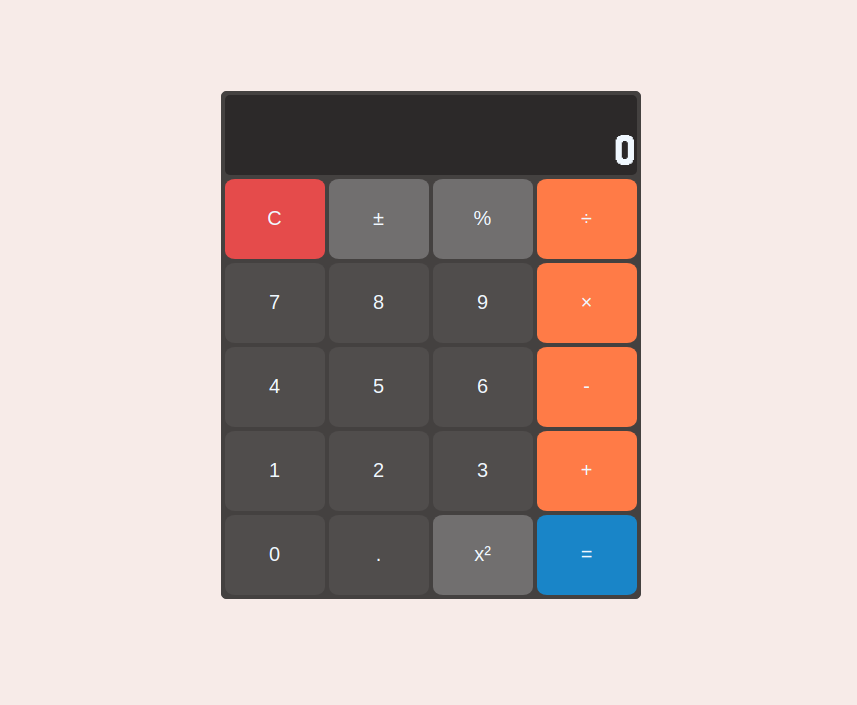

# 📱 Simple Calculator

A basic calculator built with HTML, CSS, and JavaScript. It performs basic arithmetic operations like addition, subtraction, multiplication, and division with support for decimals and negative numbers.

## 🚀 Features

- Addition, subtraction, multiplication, and division
- Decimal and negative number support
- Square (`x²`) and percentage (`%`) operations
- Clear (`C`) and toggle sign (`±`)

## 📷 Screenshot

 

